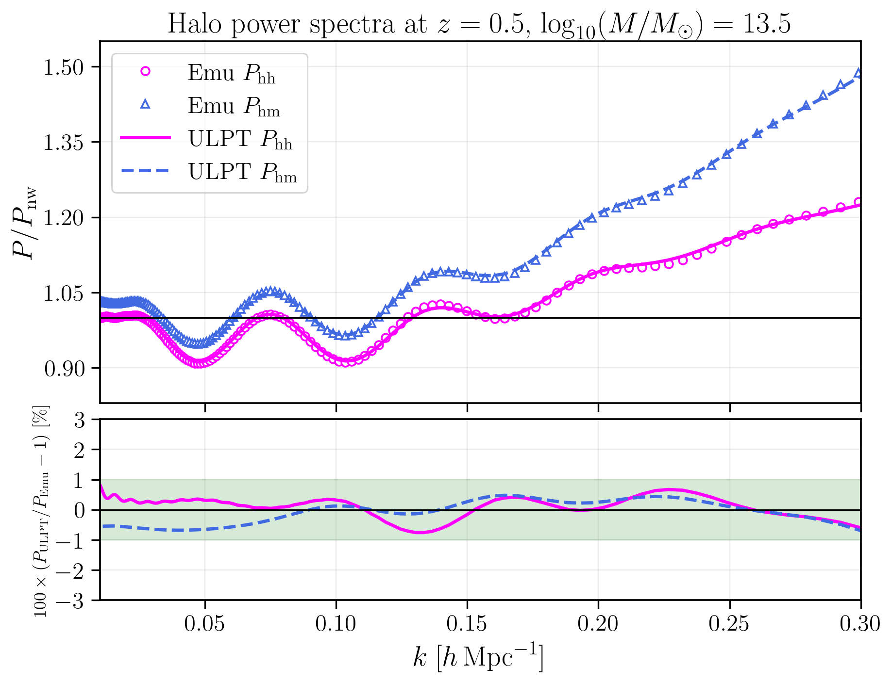

# Unified Lagrangian Perturbation Theory Toolkit (ulptkit)

**ulptkit** is a lightweight Python package for cosmological power spectrum calculations based on **Unified Lagrangian Perturbation Theory (ULPT)**.
It is designed for large-scale structure and cosmology research, offering a clean interface with minimal dependencies.

The toolkit provides:
- Nonlinear matter power spectrum calculations within the ULPT framework.
- Consistent evaluations of **galaxy–galaxy auto power spectra** and **galaxy–matter cross power spectra**.
- Demonstration scripts comparing ULPT predictions with the corresponding **halo–halo auto** and **halo–matter cross** power spectra computed by the **Dark Emulator**.

---

## Example Output

Here is an example halo power spectrum computed with ULPT (at z=0.5, logM=13.5)
compared against Dark Emulator:



---

## Features

- ULPT-based power spectrum computation:
  - `ulpt_power_spectrum(k, P_lin)`
- No-wiggle baseline spectrum (for comparison only; **not used** in ULPT power spectrum calculation):
  - `pk_nowiggle(k, omega_cdm, omega_b, h, n_s, P_lin)`
- Modular design: supply your own linear power spectrum (`P_lin`)
  from emulators or Boltzmann solvers (CLASS, CAMB).
- Optional support for **dark_emulator** (see *SciPy compatibility* below).
- Optional plotting support with **matplotlib**:
  used for visualizing comparisons; not required if you already have matplotlib installed.

---

## Requirements

- Python ≥ 3.9  
- **SciPy < 1.10** (standard install)  
- NumPy ≥ 1.24, < 3  
- mcfit ≥ 0.0.22

> **SciPy compatibility.**
> This project standardizes on **SciPy < 1.10** so that the optional `emulator`
> extra (which depends transitively on functionality removed in SciPy 1.10)
> works out of the box. ULPT power spectrum calculations **themselves do not
> require Dark Emulator**; it is only used to generate linear power spectra and
> to provide a point of comparison with ULPT results. If you compute linear
> spectra with CLASS or CAMB instead of Dark Emulator, you may experiment with
> newer SciPy versions. However, the default constraints pin
> `<1.10` to ensure maximum compatibility with the emulator workflow.

---

## Installation

### Basic installation
```bash
pip install -e .
```

### With dark emulator support
```bash
pip install -e '.[emulator]'
```

### With plotting support
```bash
pip install -e '.[plot]'
```

### With both dark emulator and plotting support
```bash
pip install -e '.[emulator,plot]'
```

### Example: Clean installation with conda environment

As a test to guarantee that `ulptkit` works in a clean setup,
you can create a fresh conda environment and install it there.
If `ulptkit` works in your existing environment, there is no need to repeat this step.
```bash
# Create a new environment with Python 3.11
conda create -n ulptkit-env python=3.11 -y
conda activate ulptkit-env

# Clone the repository
git clone https://github.com/naonori/ulptkit.git
cd ulptkit

# Install ulptkit
pip install -e '.[emulator,plot]'
```

## Using FAST-PT for 1-loop corrections (required for ULPT and biased tracers)

To compute one-loop corrections within the ULPT framework, including the
nonlinear matter power spectrum, the halo-halo auto power spectrum, and
the halo-matter cross power spectrum, you need to extend FAST-PT by adding
several functions to `matter_power_spt.py`.

### Step 1. Install FAST-PT in editable mode
```bash
git clone https://github.com/JoeMcEwen/FAST-PT.git
cd FAST-PT
pip install -e .
```

### Step 2. Edit `matter_power_spt.py`
Open the file `FAST-PT/fastpt/matter_power_spt.py` and add the following functions:

```bash
def P_22_J(k,P,P_window,C_window,n_pad):
    param_matrix=np.array([[0,0,0,0],[0,0,2,0],[0,0,4,0],[2,-2,2,0],\
                            [1,-1,1,0],[1,-1,3,0],[2,-2,0,1] ])
    Power, mat=J_k(k,P,param_matrix,P_window=P_window,C_window=C_window,n_pad=n_pad)
    A=242/735.*mat[0,:]
    B=671/1029.*mat[1,:]
    C=32/1715.*mat[2,:]
    D=0.*mat[3,:]
    E=27/35.*mat[4,:]
    F=8/35.*mat[5,:]
    reg=0.*mat[6,:]
    return 2*(A+B+C+D+E+F)+ reg
```

```bash
def P_22_b1b2(k,P,P_window,C_window,n_pad):
    param_matrix=np.array([[0,0,0,0],[0,0,2,0],[0,0,4,0],[2,-2,2,0],\
                            [1,-1,1,0],[1,-1,3,0],[2,-2,0,1] ])
    Power, mat=J_k(k,P,param_matrix,P_window=P_window,C_window=C_window,n_pad=n_pad)
    A=-72./245.*mat[0,:]
    B=88./343.*mat[1,:]
    C=64./1715.*mat[2,:]
    D=0.*mat[3,:]
    E=-8./35.*mat[4,:]
    F=8./35.*mat[5,:]
    reg=0.*mat[6,:]
    return 2*(A+B+C+D+E+F)+ reg
```

```bash
def P_22_b2b2(k,P,P_window,C_window,n_pad):
    param_matrix=np.array([[0,0,0,0],[0,0,2,0],[0,0,4,0],[2,-2,2,0],\
                            [1,-1,1,0],[1,-1,3,0],[2,-2,0,1] ])
    Power, mat=J_k(k,P,param_matrix,P_window=P_window,C_window=C_window,n_pad=n_pad)
    A=32./735.*mat[0,:]
    B=-64./1029.*mat[1,:]
    C=32./1715.*mat[2,:]
    D=0.*mat[3,:]
    E=0.*mat[4,:]
    F=0.*mat[5,:]
    reg=0.*mat[6,:]
    return 2*(A+B+C+D+E+F)+ reg
```

```bash
def P_13_b1b3(k,P):
    N=k.size
    n= np.arange(-N+1,N )
    dL=log(k[1])-log(k[0])
    s=n*dL

    cut=7
    high_s=s[s > cut]
    low_s=s[s < -cut]
    mid_high_s=s[ (s <= cut) &  (s > 0)]
    mid_low_s=s[ (s >= -cut) &  (s < 0)]

    Z=lambda r : ( 12./r**2 - 44. - 44.*r**2  + 12.*r**4 \
                 - 6./r**3*(r**2-1)**4 * log((r+1.)/np.absolute(r-1.)) ) * r 
    Z_low=lambda r : ( - 512./5. + 1536./35./r**2 - 512./105./r**4 - 512./1155./r**6 - 512./5005./r**8 ) * r
    Z_high=lambda r: ( -512./5.*r**2 + 1536./35.*r**4 - 512./105.*r**6 - 512./1155.*r**8 ) * r

    f_mid_low=Z(exp(-mid_low_s))
    f_mid_high=Z(exp(-mid_high_s))
    f_high = Z_high(exp(-high_s))
    f_low = Z_low(exp(-low_s))

    f=np.hstack((f_low,f_mid_low,80,f_mid_high,f_high))

    g= fftconvolve(P, f) * dL
    g_k=g[N-1:2*N-1]
    P_bar= 1./252.* k**3/(2*pi)**2*P*g_k

    return P_bar
```

## Examples

We provide several ready-to-run example scripts under the `examples/` directory:

- `sample_power_matter.py`
  Computes the nonlinear matter power spectrum at z=0.5 using ULPT,
  compares it against Dark Emulator, and produces plots of `P/P_nowiggle` and residuals.

- `sample_power_halo.py`
  Computes halo-halo auto and halo-matter cross power spectra at z=0.5, logM=13.5,
  including bias parameters (b1,b2,b3,Nshot), compares ULPT to Dark Emulator,
  and plots `P/P_nowiggle` and residuals.

- `sample_corr_matter.py`
  Computes the matter correlation function `\xi(r)` at z=0.5 via Hankel transform,
  compares ULPT to Dark Emulator, and plots `r^2 \xi(r)` and residuals.

- `sample_corr_halo.py`
  Computes halo correlation functions (`\xi_hh`, `\xi_hm`) at z=0.5, logM=13.5,
  compares ULPT to Dark Emulator, and plots `r^2\xi(r)` and residuals.

### Running the examples
Run any script, for example:
```bash
python examples/sample_power_matter.py
python examples/sample_power_halo.py
python examples/sample_corr_matter.py
python examples/sample_corr_halo.py
```

The scripts automatically generate PNG figures and save them into the
`figures/` directory (e.g., `figures/power_z0p5_logM13p5.png`).

## Citation

If you use `ulptkit` in your research, please cite the corresponding paper(s) introducing Unified Lagrangian Perturbation Theory (ULPT):

### ULPT theory paper
```bibtex
@article{Sugiyama:2025ntz,
    author        = {Sugiyama, Naonori},
    title         = "{A Unified Lagrangian Framework for Galaxy Clustering: Consistent Modeling of Bias, Redshift-Space Distortions, and Reconstruction}",
    eprint        = "2508.17331",
    archivePrefix = "arXiv",
    primaryClass  = "astro-ph.CO",
    month         = "8",
    year          = "2025"
}
```

### One-loop matter power spectrum paper

(To appear. Preprint / DOI will be added once available.)

### Biased power spectrum paper

(To appear. Preprint / DOI will be added once available.)

## License
MIT License (c) 2025 Naonori Sugiyama

## Issues and Contact
If you find a bug, have a question, or would like to suggest an improvement,
please open an issue on the [Issues page](https://github.com/naonori/ulptkit/issues).

Alternatively, you may contact the author directly by email:
**nao.s.sugiyama@gmail.com**

